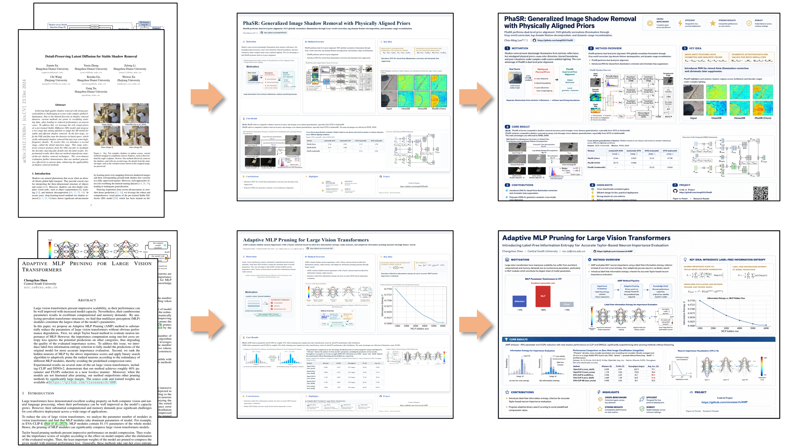

# 📜 Paper Reading Assistant Agent  
            

 
 

> For paper analysis, comprehension, and visual presentation — transforming dense academic papers into intuitive, interactive poster‑style knowledge blueprints.

---

## 🚀 Show

  

---

## 📌 Project Overview

**Paper Reading Assistant Agent** is designed to help researchers, students, and engineers quickly fetch, understand, and visualise academic papers from arXiv. It is more than just a summary generator — it is a complete pipeline that converts a paper into a knowledge blueprint.

### 🔥 Aim
- **Full‑content extraction** – Retrieve the source files from arXiv and extract all elements including text, tables, formulae, and embedded figures.
- **Deep understanding** – Leverage large language models (LLMs) to analyse the paper’s structure, logical flow, and core contributions.
- **🔍 Poster blueprint generation** – Automatically map the paper’s content into a well‑structured “poster tree”, where each section is populated with the most suitable content (e.g., abstract, methodology, experiments, conclusions).
- **Intelligent visual enhancement** – Automatically generate SVG diagrams, flowcharts, or data charts for areas with low information density.
- **🔍 Iterative review and redrawing** – Evaluate the current poster quality through a visual inspection mechanism (Harness) and iteratively refine layout and presentation based on historical Q&A.

---

## 🕒 Changelog Overview

| Date       | New / Improved Features |
|------------|-------------------------|
| 2026-07-19 | Completed the full‑text arXiv paper extraction module, supporting extraction of PDF text, tables, LaTeX formulae, and embedded images. |
| 2026-07-26 | Integrated the LLM analysis pipeline to enable paper content recognition. |
| 2026-08-16 | (rigid layout) *[removed the original "poster layout blueprint tree" data structure plan — 🔍 optimisation point]*. |
| 2026-08-23 | Added automatic blank‑area completion, generating SVG based on remaining space in each section. |
| 2026-08-30 | Miscellaneous optimisations *[removed the initial Harness visual inspection module, which used to provide quality scoring and issue annotation for rendered posters — 🔍 optimisation point]*. |